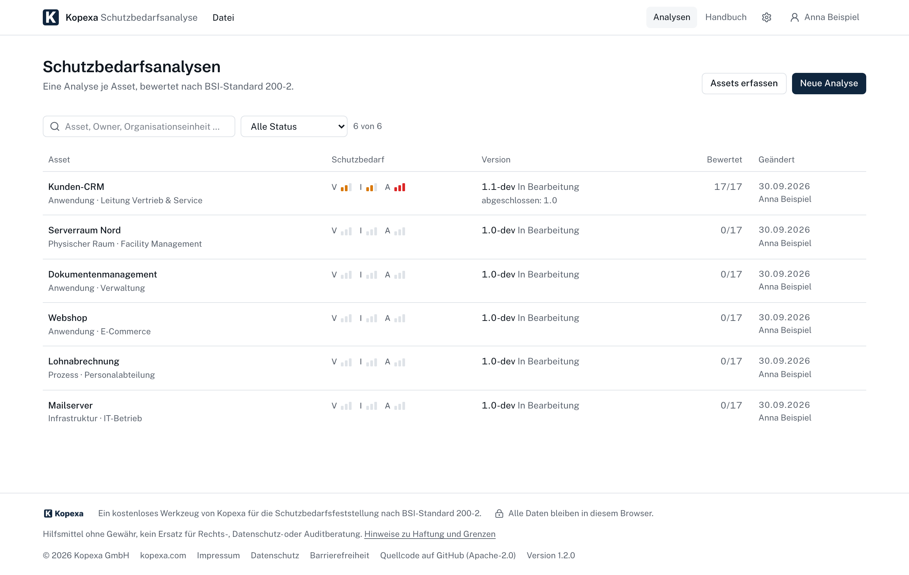
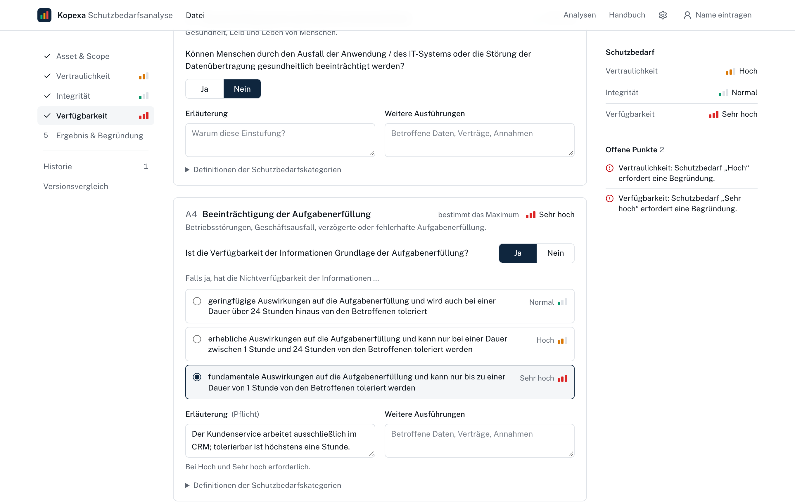
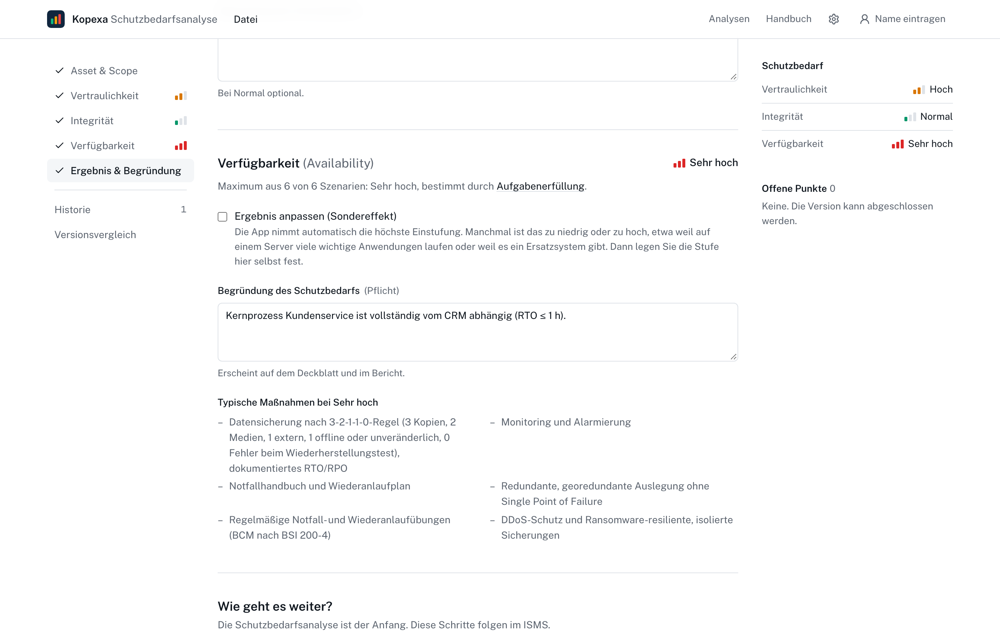
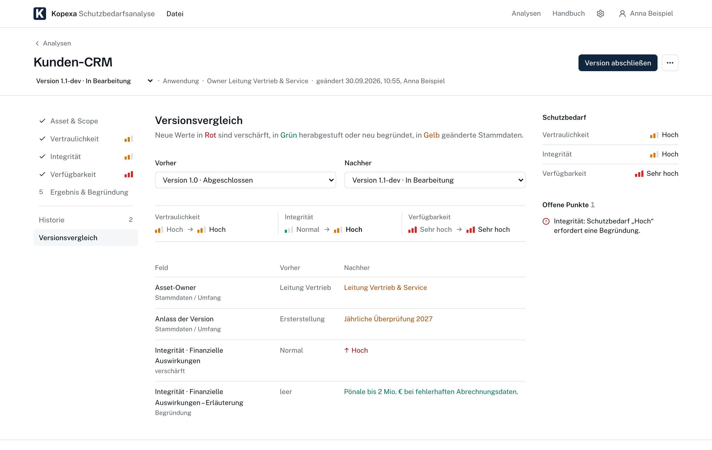
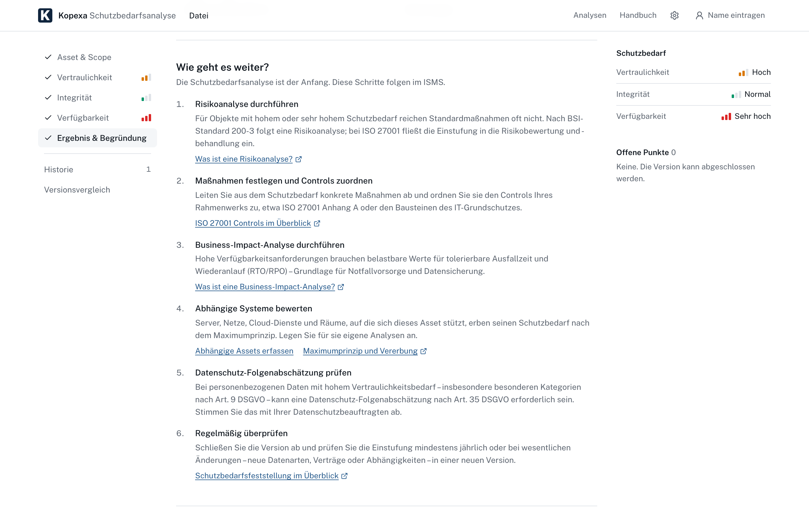
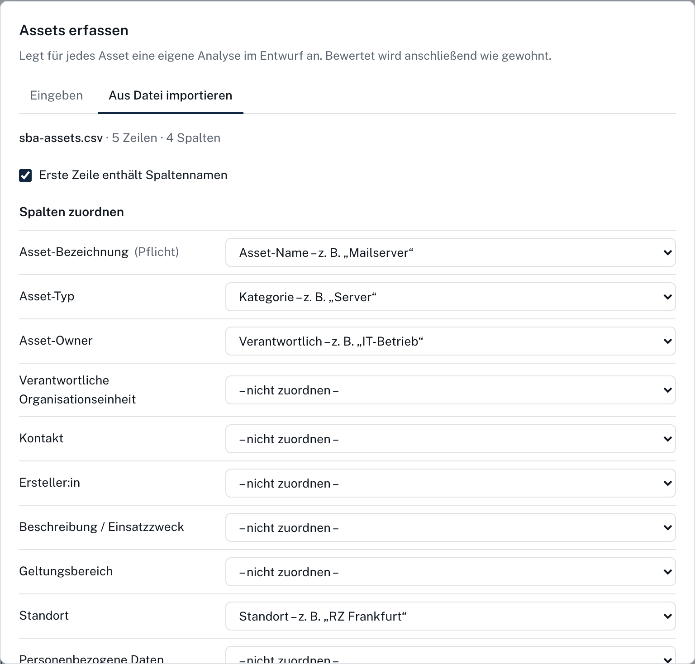
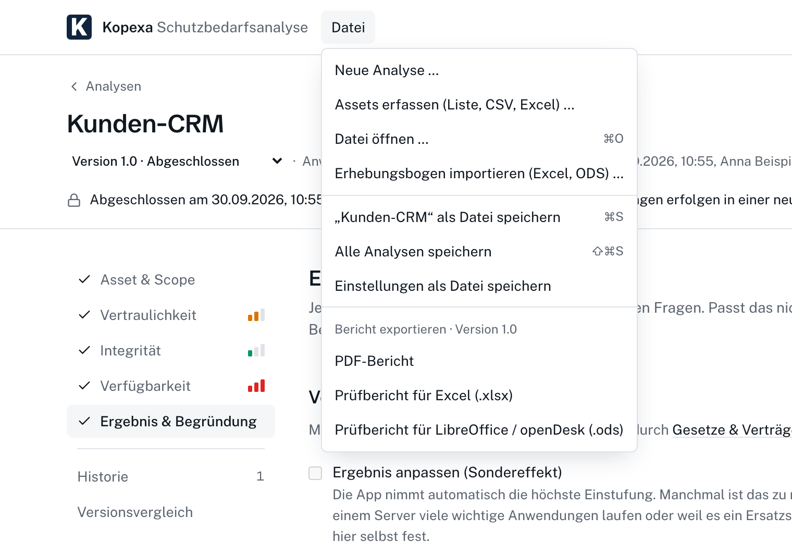
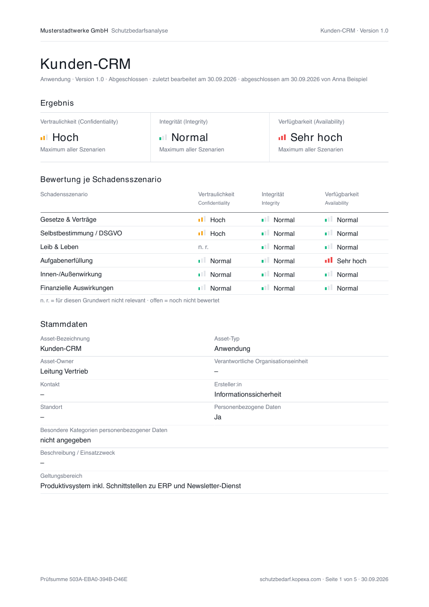
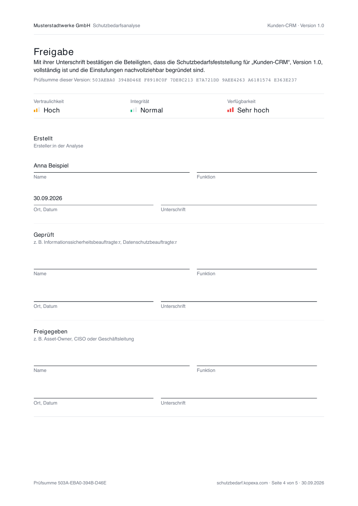
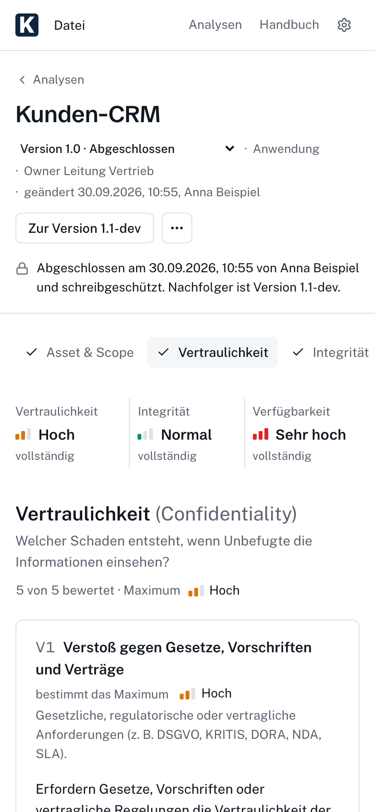

<div align="center">

<a href="https://schutzbedarf.kopexa.com/">
  <picture>
    <source media="(prefers-color-scheme: dark)" srcset="docs/brand/sba-wordmark-dark.svg">
    
  </picture>
</a>

<br>

**Protection needs assessment according to BSI IT-Grundschutz 200-2 and ISO/IEC 27001, in the browser.**<br>
Free, offline, no account, and nothing leaves your device.

[**Open the app**](https://schutzbedarf.kopexa.com/) ·
[Handbook](https://schutzbedarf.kopexa.com/hilfe) ·
[Sample report (PDF)](docs/screenshots/report.pdf) ·
[kopexa.com](https://kopexa.com/?utm_source=github&utm_medium=readme&utm_campaign=sba) ·
[Report an issue](https://github.com/kopexa-grc/sba/issues) ·
[Mirror on OpenCoDE](https://gitlab.opencode.de/kopexa/sba)

[](https://github.com/kopexa-grc/sba/actions/workflows/deploy.yml)
[](LICENSE)
[](#accessibility)
[](#privacy-by-design)
[](publiccode.yml)

<br>



</div>

---

> **Kurz auf Deutsch:** Die Kopexa Schutzbedarfsanalyse ersetzt den klassischen Excel-Erhebungsbogen. Sie führt Schritt für
> Schritt durch Vertraulichkeit, Integrität und Verfügbarkeit, wendet das Maximumprinzip an, verlangt Begründungen, wo
> Auditoren sie erwarten, und versioniert jede Einstufung mit Änderungsprotokoll. Ergebnis ist ein unterschriftsreifer
> PDF-Bericht, dazu Excel und ODS für LibreOffice und openDesk. Alles läuft im Browser, auch offline, ohne Konto, und
> keine Daten verlassen Ihr Gerät. Kostenlos und quelloffen, von [Kopexa](https://kopexa.com/de?utm_source=github&utm_medium=readme&utm_campaign=sba).
> **[Jetzt öffnen →](https://schutzbedarf.kopexa.com/)**

## Why

Every ISMS starts with the same question: how much protection does this asset need? Most organizations answer it in a
spreadsheet that has been copied, extended and patched for years. Formulas break, justifications go missing, and nobody
can tell which version the auditor saw last year.

This app keeps the familiar method and fixes the rest:

- **The same questions** as the widely used BSI reference workbook, 17 damage scenarios across C, I and A.
- **Nothing to install and nothing to sign up for.** Open the link, start the first analysis.
- **Audit-ready by default:** mandatory justifications for "Hoch" and "Sehr hoch", versions that are read-only once
  closed, a field-level change log, and a checksum on every report page.

The user interface is in German, the language of the method and its audience.

## Features

<table>
<tr>
<td width="50%" valign="top">

### Guided assessment

One step per protection goal. Each scenario asks a yes/no question first and only then for the extent of the damage. The
current maximum is visible at all times, including which scenario determines it.

</td>
<td width="50%" valign="top">



</td>
</tr>
<tr>
<td valign="top">



</td>
<td valign="top">

### Results you can defend

The maximum principle per goal, special effects (inheritance, cumulation, distribution) as a documented adjustment,
typical measures for the level, and a list of open points that blocks closing until every required justification is there.

</td>
</tr>
<tr>
<td valign="top">

### Versions and change log

Close a version and it becomes read-only. Changes go into a new version, and changing an existing rating asks for a
reason. The comparison view shows exactly what moved, and in which direction.

</td>
<td valign="top">



</td>
</tr>
<tr>
<td valign="top">



</td>
<td valign="top">

### What comes next

The analysis is the start, not the end. Depending on the result the app suggests the next steps in the ISMS: risk
analysis according to BSI 200-3, controls, business impact analysis, dependent systems and a DPIA check.

</td>
</tr>
<tr>
<td valign="top">

### Bring your asset list

Paste a list or import CSV, Excel or ODS. Columns are matched automatically and can be remapped before anything is
created. Existing workbooks in the legacy format can be imported as well.

</td>
<td valign="top">



</td>
</tr>
<tr>
<td valign="top">



</td>
<td valign="top">

### Works like a desktop app

A familiar "Datei" menu with <kbd>⌘</kbd>/<kbd>Ctrl</kbd>+<kbd>S</kbd> and <kbd>⌘</kbd>/<kbd>Ctrl</kbd>+<kbd>O</kbd>. Install
it as an app and open `.sba` files by double-click. Works offline once loaded.

</td>
</tr>
</table>

## Reports

<table>
<tr>
<td width="50%"></td>
<td width="50%"></td>
</tr>
</table>

| Format | What it is for |
| --- | --- |
| **PDF** | The report to sign: summary, justifications, next steps and measures, a separate sign-off page and an appendix with change log and method. Every page carries a SHA-256 checksum of the version, so pages from different versions cannot be mixed unnoticed. [See a sample →](docs/screenshots/report.pdf) |
| **Excel (.xlsx)** | Audit workbook in the layout of the reference form, with the original formulas, change log and definitions. [Download a sample →](docs/screenshots/report.xlsx) |
| **ODS** | The same workbook as OpenDocument for LibreOffice, Collabora and openDesk. [Download a sample →](docs/screenshots/report.ods) |
| **.sba** | The app's own file format for saving and opening: gzip-compressed, schema-versioned JSON. One analysis, all analyses with settings, or settings only. |

Your organization name and logo, and optionally the consultancy that prepared the report, appear on every report.

## Privacy by design

- **No server.** The app is a static site. All data lives in your browser's IndexedDB.
- **No account, no tracking, no cookies.** Nothing to consent to.
- **Offline first.** After the first visit the service worker serves the app without a network.
- **You own the files.** Save to `.sba` whenever you like and open it on any other device. The app reminds you when the
  last backup is getting old.

## Accessibility

Accessibility is a requirement, not a feature. The app targets **WCAG 2.2 AA** and all main screens are checked with
[axe-core](https://github.com/dequelabs/axe-core) in CI.

- Complete keyboard operation, including the menu bar, radio groups and dialogs, with a visible focus everywhere
- Skip link, focus moved to the page heading on navigation, a page title per route
- Hints and errors linked to their fields for screen readers, status messages as live regions
- Level colors with at least 3:1 contrast, never color alone: every level has a label and a bar symbol
- Reflows down to 320 px without horizontal scrolling

<p align="center"></p>

## Getting started

### Use it

Open **[schutzbedarf.kopexa.com](https://schutzbedarf.kopexa.com/)**. A guided tour explains the basics on the first
visit, and "Beispiel ansehen" loads a complete sample analysis. To install it, use "Install app" in Chrome or Edge,
or "Add to Home Screen" on iOS.

### Host it yourself

The build is a folder of static files. Any web server works, including an intranet server without internet access.

```sh
pnpm install
BASE_PATH=/ pnpm build     # use BASE_PATH=/sba/ for a sub-path
# serve ./dist, e.g. with: npx vite preview
```

`404.html` and one `index.html` per route are generated, so deep links work on GitHub Pages and plain file servers.

### Develop

Requires Node.js 22+ and pnpm.

```sh
pnpm dev          # http://localhost:5173
pnpm test         # unit tests (Vitest)
pnpm test:e2e     # end-to-end and accessibility tests (Playwright + axe)
pnpm typecheck
pnpm lint
```

The README screenshots are generated from a production build:

```sh
pnpm build && npx vite preview --port 4180 &
node scripts/screenshots.mjs    # writes docs/screenshots/, needs pdftoppm (poppler)
```

## How it works

| Path | Contents |
| --- | --- |
| `src/domain` | Question catalog, scoring, rating scheme, versioning, diff, checksum, next steps. Pure functions, no I/O. |
| `src/db` | Dexie (IndexedDB) and the repository: audited updates, workflow transitions, import and export |
| `src/io` | `.sba` format, Excel and ODS import/export, PDF report. Heavy libraries are loaded on demand. |
| `src/workspace` | The assessment steps, result, history and comparison |
| `src/pages` | Overview, handbook, settings, styleguide |
| `e2e` | Playwright flows and axe accessibility checks |
| `docs/STYLEGUIDE.md` | Design tokens and component rules |

**Stack:** React 19, TypeScript, Vite, Tailwind CSS 4, Radix UI primitives, Dexie, ExcelJS, react-pdf, fflate,
zod, vite-plugin-pwa. Tested with Vitest, Playwright and axe-core.

## Methodology

The assessment follows **BSI-Standard 200-2** (Schutzbedarfsfeststellung) and fits into ISO/IEC 27001 risk assessment.

- **Three protection goals:** Vertraulichkeit (confidentiality), Integrität (integrity), Verfügbarkeit (availability)
- **Three levels:** Normal, Hoch, Sehr hoch
- **Six damage scenarios** per goal: laws and contracts, informational self-determination, physical integrity, business
  operations, reputation, and financial impact
- **Maximum principle:** each goal takes the highest rating of its scenarios
- **Special effects:** inheritance, cumulation and distribution can adjust the result, always with a reason

The thresholds are configurable. Every organization defines its own financial limits and tolerable downtimes, and every
version stores the scheme it was rated with. The defaults mirror the reference workbook: financial damage from €1m is
"Hoch" and from €10m "Sehr hoch"; a tolerable outage of at most 24 hours is "Hoch" and of at most one hour "Sehr hoch".

Differences from the reference workbook:

- As in the workbook, physical integrity is not rated for confidentiality, so there are 17 scenarios, not 18.
- The availability question on physical integrity asks about outage instead of manipulation. The workbook had copied the
  integrity wording.

## Need a hand?

The app is free and stays free. If you want help with the assessment, the follow-up risk analysis or a complete ISMS,
[Kopexa](https://kopexa.com/de?utm_source=github&utm_medium=readme&utm_campaign=sba) and its
[consulting partners](https://kopexa.com/de/partners?utm_source=github&utm_medium=readme&utm_campaign=sba) are there for you.
Consultants are welcome to use the app with their clients. Put your company name and logo under "Erstellt durch" in the
settings.

## Roadmap

- Risk analysis according to BSI-Standard 200-3 for assets with high protection needs
- Asset register export across all analyses
- Review dates and reminders for periodic reassessment

Ideas and requests are welcome in the [issues](https://github.com/kopexa-grc/sba/issues).

## Contributing

Contributions are welcome. [CONTRIBUTING.md](CONTRIBUTING.md) explains the setup, the checks every change has to
pass, the design and accessibility rules, and the commit format that drives versioning and the changelog.

## Security

Please do not report security issues in public issues. See [SECURITY.md](SECURITY.md).

## License

[Apache License 2.0](LICENSE). "Kopexa" and the Kopexa logo are trademarks of Kopexa GmbH, see [NOTICE](NOTICE).

This app is an aid without warranty. It does not replace legal, data protection or audit advice, and you remain
responsible for the classification of your assets.

---

<div align="center">
<br>
<a href="https://kopexa.com/?utm_source=github&utm_medium=readme&utm_campaign=sba">
  <picture>
    <source media="(prefers-color-scheme: dark)" srcset="docs/brand/kopexa-logo-light.png">
    
  </picture>
</a>
<br><br>
<sub>Built by <a href="https://kopexa.com/?utm_source=github&utm_medium=readme&utm_campaign=sba">Kopexa</a>, the GRC platform for ISO 27001, NIS2, TISAX and GDPR.</sub><br>
<sub><a href="https://kopexa.com/de/legal/imprint">Impressum</a> · <a href="https://kopexa.com/de/legal/privacy">Datenschutz</a> · <a href="https://kopexa.com/de/legal/accessibility-statement">Barrierefreiheit</a></sub>
</div>
